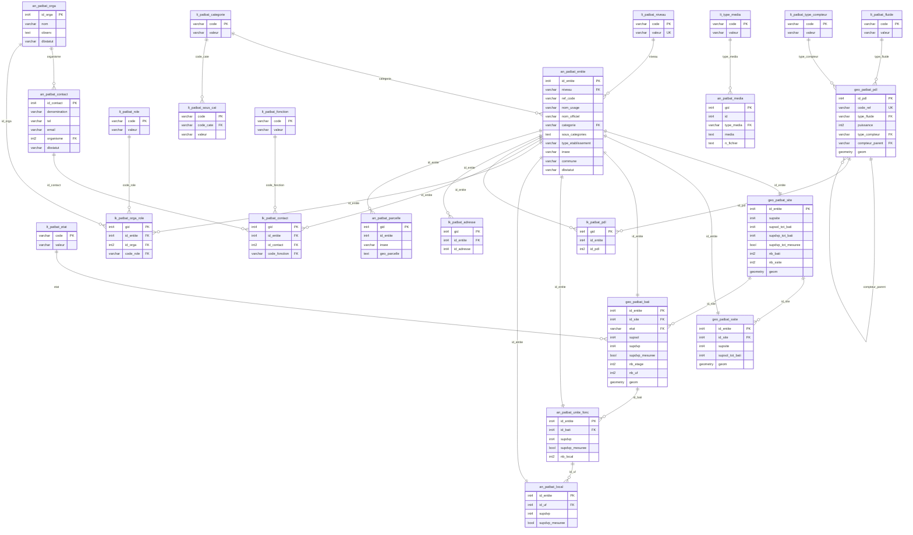

## Schéma fonctionnel

## Résumé fonctionnel

Le modèle de données est composé d'une table principale `an_patbat_entite` qui comporte les informations communes aux 5 niveaux du référentiel et crée l'identifiant unique `id_entite` pour chaque entité.

Chaque niveau a aussi une table spécifique qui réutilise l'identifiant `id_entite` dans laquelle est stocké les informations spécifique à ce niveau :
- Site : `geo_patbat_site`
- Sous-site : `geo_patbat_ssite`
- Bâtiment : `geo_patbat_bati`
- Unité fonctionnelle : `an_patbat_unite_fonc`
- Local : `an_patbat_local`

Les données extérieures aux niveaux (`médias`, `contacts`...) sont stockées dans des tables extérieures détaillées ci-dessous, elles réutilisent l'`id_entite`.

Les tables sont modifiées via des vues regroupant les informations de la table principale ainsi que des tables spécifique au niveau, ces vues sont accompagnées d'un trigger 'instead of' ainsi que d'une fonction qui modifie les données des tables.

## Dépendances

- Les fonctions `ft_r_parcelles_bati` et `ft_r_parcelles_site_ssite` utilisent la table `geo_parcelle` du schéma `r_cadastre` afin de récupérer les parcelles sur lesquelles se trouvent site, sous-site et bâtiment de façon automatique.

- Les fonctions `ft_r_insee_commune` et `ft_m_gestion_v_site` utilisent la table `geo_osm_commune` du schéma `r_osm` afin de récupérer les codes insee et commune sur lesquels se trouvent site, sous-site et bâtiment. Ainsi que pour vérifier que le site ne se trouve que dans une commune.

  
## Classes
