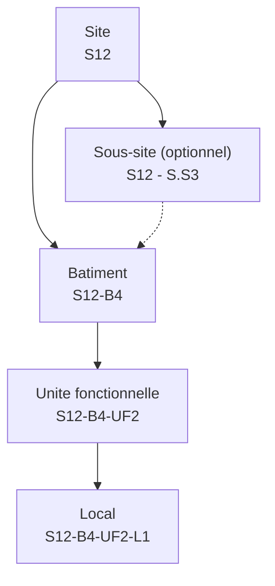
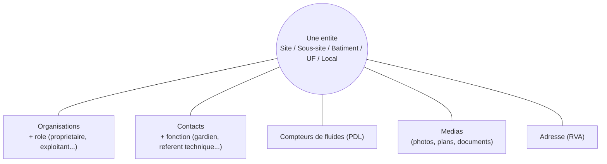
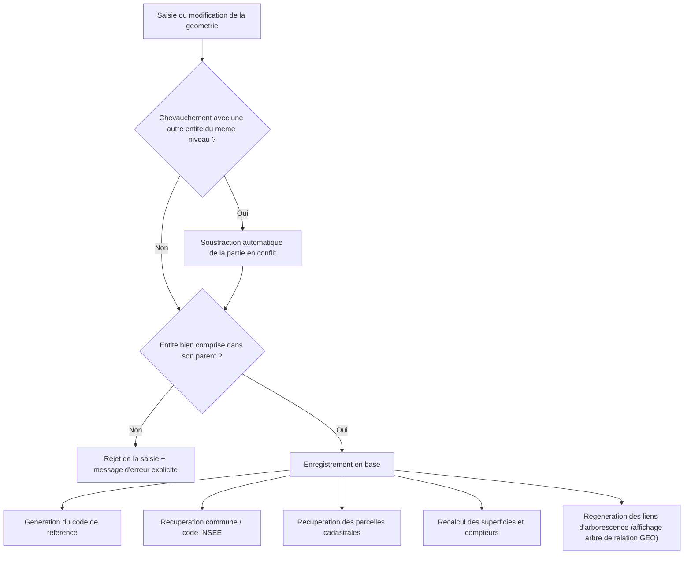
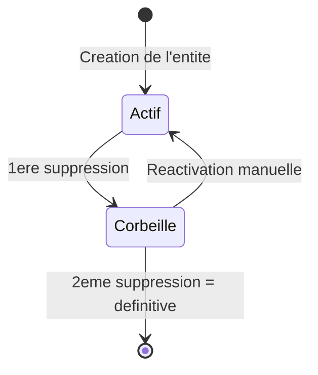
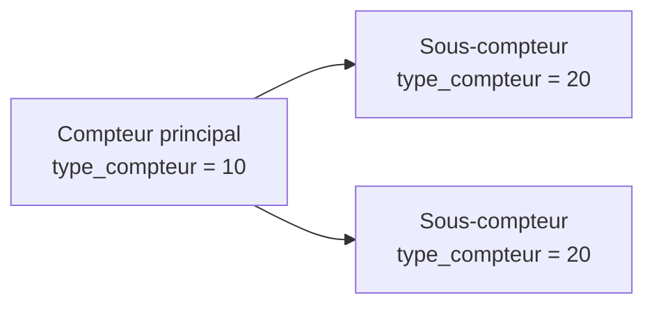

## 1. La hiérarchie du patrimoine

Le patrimoine est organisé en **5 niveaux emboîtés** :

| Niveau | Définition fonctionnelle | Géométrie propre |
|---|---|---|
| **Site** | Emprise foncière globale (ex. un groupe scolaire, un centre technique) | Oui |
| **Sous-site** | Subdivision d'un site (ex. une aile, une cour distincte) — optionnel | Oui |
| **Bâtiment** | Un bâtiment physique | Oui |
| **Unité fonctionnelle** | Une partie fonctionnelle d'un bâtiment (ex. un étage, une aile) | Non |
| **Local** | Une pièce ou un espace au sein d'une unité fonctionnelle - optionnel | Non |

Chaque niveau hérite automatiquement d'un **code de référence** construit à partir de celui du niveau parent (voir [§3.1](#31-génération-automatique-du-code-de-référence)) :

---
## 2. Les informations transverses liées à une entité

Quel que soit son niveau, une entité peut se voir rattacher les objets suivants :

- **Organisations et rôles** : une même entité peut avoir plusieurs organisations rattachées, chacune avec un rôle (propriétaire, nu-propriétaire, exploitant, autre). Le système empêche d'attribuer deux fois le même rôle à la même organisation sur la même entité.
- **Contacts** : chaque contact rattaché à une entité a une fonction (direction, gardien, référent sécurité, prestataire...). Même règle d'unicité que pour les organisations.
- **Fluides / compteurs (PDL)** : [§5 dédié ci-dessous](#5-fluides-et-compteurs-pdl)
- **Médias** : photos, plans, notices techniques, devis, rapports d'expertise... rattachés librement à une entité.
- **Adresse** : rattachement au référentiel adresse (RVA).

---
## 3. Automatismes de saisie

L'essentiel de la valeur du référentiel tient dans les automatismes déclenchés à chaque saisie ou modification, via les vues de gestion (une par niveau). L'utilisateur ne travaille jamais directement sur les tables techniques : il saisit dans une vue, et le système répercute et enrichit automatiquement les données.

### 3.1 Génération automatique du code de référence

Chaque entité reçoit un code unique, lisible et hiérarchique, sans aucune saisie manuelle :

| Niveau | Construction | Exemple |
|---|---|---|
| Site | `S` + n° de séquence global | `S12` |
| Sous-site | `<code site>` + ` - S.S` + n° incrémental propre au site | `S12 - S.S3` |
| Bâtiment | `<code site>` + `-B` + n° incrémental propre au site | `S12-B4` |
| Unité fonctionnelle | `<code bâtiment>` + `-UF` + n° incrémental propre au bâtiment | `S12-B4-UF2` |
| Local | `<code UF>` + `-L` + n° incrémental propre à l'UF | `S12-B4-UF2-L1` |

Point important : les compteurs utilisés (`nb_bati`, `nb_ssite`, `nb_uf`, `nb_local`) ne sont **jamais décrémentés**, même en cas de suppression. Un code de référence n'est donc **jamais réutilisé**, ce qui garantit la traçabilité dans le temps (y compris pour des entités passées en corbeille).

### 3.2 Contrôles topologiques automatiques

- **Non-superposition** : deux entités actives d'un même niveau ne peuvent pas se chevaucher géographiquement. Si un chevauchement est détecté à la saisie, le système **découpe automatiquement** la nouvelle géométrie pour ne garder que la partie non déjà occupée (au lieu de bloquer la saisie).
- **Confinement dans le parent** : un sous-site doit être dans un site, un bâtiment dans un site, une intersection est recherchée automatiquement pour déterminer le site/sous-site parent (pas besoin de le sélectionner manuellement)
- **Saisie sous-site** : si un sous-site n'est pas compris entièrement dans un site lors de la saisie, le système **découpe automatiquement** la géométrie du sous-site pour le faire rentrer dans le site, si un sous-site est compris dans 2 sites différents à la saisie, alors le système le met dans le site avec l'aire d'intersection la plus grande.
- **Commune unique** : un site ne peut pas chevaucher deux communes différentes ; la saisie est bloquée dans ce cas.
- **Cohérence des statuts** : impossible de créer ou réactiver une entité active si son entité parente est en corbeille.

### 3.3 Enrichissement géographique automatique

À chaque création ou modification de géométrie :
- La **commune** et le **code INSEE** sont automatiquement déterminés par intersection avec le référentiel des communes (schéma `r_osm`) ;
- Les **parcelles cadastrales** concernées sont automatiquement identifiées par intersection avec le cadastre (schéma `r_cadastre`) et une décomposition section/numéro est réalisée automatiquement.

### 3.4 Calcul automatique des superficies et compteurs

- La **superficie au sol** (site, sous-site, bâtiment) est calculée automatiquement à partir de la géométrie dessinée.
- La **superficie au sol totale des bâtiments** d'un site ou d'un sous-site est recalculée automatiquement à chaque ajout, modification ou suppression d'un bâtiment ou site/sous-site.
- La **superficie développée** (surface de plancher) peut être saisie manuellement par bâtiment/UF/local, avec une case « mesurée » permettant de distinguer une valeur fiable (relevé/plan) d'une valeur estimée.
- La **superficie développée totale des bâtiments** au niveau du site est calculée automatiquement avec la superficie développée des bâtiments et n'est considéré comme « mesuré » que si **tous** les bâtiments qui le composent ont eux-mêmes une valeur mesurée — le fait que cette superficie totale soit mesurée empêche la saisie manuelle de celle-ci.

### 3.5 Nommage automatique

- **Site** et **Sous-site** : le nom d'usage est **obligatoire**, la saisie est bloquée s'il est vide.
- **Bâtiment**, **Unité fonctionnelle**, **Local** : le nom d'usage est facultatif. S'il n'est pas renseigné, le système génère automatiquement un nom par défaut à partir du parent, par exemple *« Groupe scolaire X - Batiment sans nom »*, permettant de continuer la saisie sans bloquer l'utilisateur tout en gardant une trace lisible.

### 3.6 Catégories, sous-catégories et types d'établissement

- Chaque entité a une **catégorie principale** (Administratif, Enseignement, Sportif...) et peut avoir plusieurs **sous-catégories** rattachées.
- Si l'utilisateur **change la catégorie principale** d'une entité, les sous-catégories déjà sélectionnées qui n'appartiennent plus à la nouvelle catégorie sont **automatiquement retirées**, pour éviter des combinaisons incohérentes (ex. garder « École maternelle » sur une entité repassée en catégorie « Sportif »).
- Le champ multivalué **type d'établissement** (ERP / ERT) est saisi via une liste à choix multiple dans QGIS/GEO ; le format technique renvoyé par QGIS est automatiquement nettoyé et reformaté (`ERP;ERT`) pour rester cohérent avec GEO.

---

## 4. La corbeille : suppression et restauration

Aucune donnée n'est perdue lors d'une première suppression. Le référentiel fonctionne comme une corbeille à deux temps :

- **1ère suppression** : l'entité passe simplement en statut « désactivé » (corbeille). Elle n'apparaît plus dans les vues actives mais toutes ses données restent en base.
  - **Effet en cascade** : désactiver un site désactive automatiquement tous les sous-sites, bâtiments, UF et locaux compris dans son emprise géographique qui étaient encore actifs. De même avec le fait de désactiver un bâtiment et ses UF et locaux.
- **Réactivation** : possible depuis la corbeille, à condition que l'entité **parente soit elle-même active** (impossible de réactiver un bâtiment si son site est toujours en corbeille — il faut réactiver le site en premier).
- **2ème suppression (depuis la corbeille)** : suppression **physique et définitive**. Dans ce cas, toutes les entités filles situées dans l'emprise géographique sont également supprimées définitivement, qu'elles soient actives ou déjà en corbeille.

---

## 5. Fluides et compteurs (PDL)

Les Points De Livraison (PDL) représentent les compteurs de fluides (électricité, gaz, eau, réseau de chaleur) rattachés au patrimoine.

- Un compteur est soit **principal**, soit **sous-compteur** rattaché à un compteur principal existant.
- Le système empêche plusieurs incohérences courantes :
  - créer un sous-compteur si aucun compteur principal n'existe encore ;
  - qu'un compteur principal ait lui-même un compteur parent ;
  - qu'un sous-compteur soit son propre parent ;
  - repasser un compteur principal en sous-compteur tant que d'autres sous-compteurs lui sont encore rattachés.
- Un même PDL peut être rattaché à plusieurs niveaux à la fois (site, bâtiment, UF, local), pour représenter par exemple un compteur desservant un bâtiment entier ou un seul local.
- Les PDL sont reliés graphiquement aux entités rattachées sur la carte dans GEO — les sous-compteurs sont reliés à leurs compteurs parent

---

## 6. Traçabilité

Chaque création, modification ou suppression sur les tables principales (entité générique, site, sous-site, bâtiment, UF, local) est **automatiquement journalisée** : la donnée avant et après modification est conservée dans une table d'historique, avec la date de l'opération. Cette journalisation ne nécessite aucune action de l'utilisateur et permet, en cas de besoin, de retracer l'origine d'une modification.
